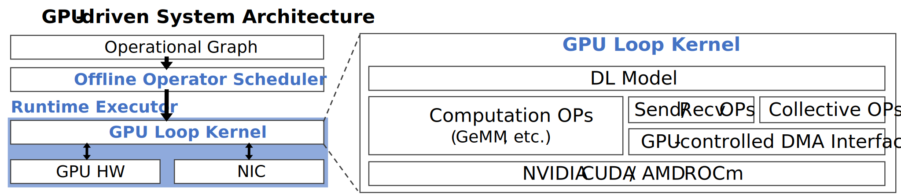
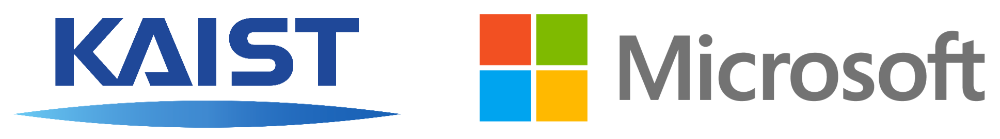

# ARK

A GPU-driven system framework for scalable AI applications.

[](LICENSE)
[](https://github.com/microsoft/ark/actions/workflows/codeql.yml)
[](https://dev.azure.com/binyli/HPC/_build/latest?definitionId=6&branchName=main)

See [Quick Start](docs/quickstart.md) to quickly get started.

## Overview

ARK is a deep learning framework especially designed for highly optimized performance over distributed GPUs. Specifically, ARK adopts a GPU-driven execution model, where the GPU autonomously schedule and execute both computation and communication without any CPU intervention.

ARK provides a set of APIs for users to express their distributed deep learning applications. ARK then automatically schedules a GPU-driven execution plan for the application, which generates a GPU kernel code called *loop kernel*. The loop kernel is a GPU kernel that contains a loop that iteratively executes the entire application, including both computation and communication. ARK then executes the loop kernel on the distributed GPUs.



## Status & Roadmap

ARK is under active development and a part of its features will be added in a future release. The following describes key features of each version.

### ARK v0.1 (Latest Release)

* The default tile-based operator scheduler
* A simple software communication stack
* Transformer inference examples

### ARK v0.2 (TBU, Sep. 2023)

* A simple operator scheduler for debugging
* Extended communication interfaces
* Support more operators
* More inference examples

### ARK v0.3 (TBU, Nov. 2023)

* Full support for the operator profiler
* High-performance collective communication
* Support more operators
* More inference & training examples

## Contributing

This project welcomes contributions and suggestions.  Most contributions require you to agree to a
Contributor License Agreement (CLA) declaring that you have the right to, and actually do, grant us
the rights to use your contribution. For details, visit https://cla.opensource.microsoft.com.

When you submit a pull request, a CLA bot will automatically determine whether you need to provide
a CLA and decorate the PR appropriately (e.g., status check, comment). Simply follow the instructions
provided by the bot. You will only need to do this once across all repos using our CLA.

This project has adopted the [Microsoft Open Source Code of Conduct](https://opensource.microsoft.com/codeofconduct/).
For more information see the [Code of Conduct FAQ](https://opensource.microsoft.com/codeofconduct/faq/) or
contact [opencode@microsoft.com](mailto:opencode@microsoft.com) with any additional questions or comments.

## Trademarks

This project may contain trademarks or logos for projects, products, or services. Authorized use of Microsoft 
trademarks or logos is subject to and must follow 
[Microsoft's Trademark & Brand Guidelines](https://www.microsoft.com/en-us/legal/intellectualproperty/trademarks/usage/general).
Use of Microsoft trademarks or logos in modified versions of this project must not cause confusion or imply Microsoft sponsorship.
Any use of third-party trademarks or logos are subject to those third-party's policies.

## Citations



ARK is a collaborative research initiative between KAIST and Microsoft Research.
If you use this project in your research, please cite our [NSDI'23 paper]:

```bibtex
@inproceedings{HwangPSQCX23,
  author    = {Changho Hwang and
               KyoungSoo Park and
               Ran Shu and
               Xinyuan Qu and
               Peng Cheng and
               Yongqiang Xiong},
  title     = {ARK: GPU-driven Code Execution for Distributed Deep Learning},
  booktitle = {20th {USENIX} Symposium on Networked Systems Design and Implementation ({NSDI} 23)},
  year      = {2023},
  publisher = {{USENIX} Association},
}
```

[NSDI'23 paper]: https://www.usenix.org/conference/nsdi23/presentation/hwang
