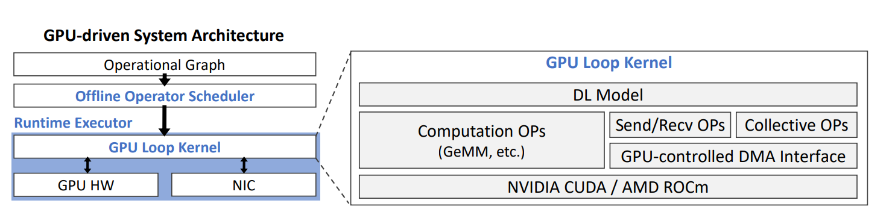

# A Quick Guide to Using ARK with Python for DNN Applications

Welcome to this tutorial on using ARK to run a simple deep neural network (DNN) application in Python. We will walk you through a basic Python example to illustrate the process.

After completing the [installation](./install.md), you can run the tutorial example at [tutorial.py](../examples/tutorial/tutorial.py) to see how ARK works. 

```bash
python examples/tutorial/tutorial.py
```

ARK is a GPU-driven code execution system. The architecture is depicted here: 

There are environment variables available to configure ARK. For more details about these variables, please refer to [Environment Variables](./env.md).

Before diving in, let's import the required modules and initialize ARK:

```python
import ark
import numpy as np

# Initialize the ARK runtime.
ark.init()
```
First, we need to create the operational graph for our DNN model. In this example, we define a simple model with two input tensors. The output tensor is the sum of these input tensors.

```python
# Create a Model instance
model = ark.Model()

# Create two tensors
input = model.tensor(ark.Dims(32,), ark.TensorType.FP16)
other = model.tensor(ark.Dims(32,), ark.TensorType.FP16)

# Add input and other to get output tensor
output = model.add(input, other)
```

Next, we need to create an executor for the model. Once it is created, the executor automatically runs a scheduler that schedules the model's GPU tasks. After the scheduling, a code generator will generate a CUDA kernel that runs the model.

```python
exe = ark.Executor(0, 0, 1, model, "tutorial_model")
```

Now, we instruct the executor to compile the model.

```python
exe.compile()
```

At this step, the system prints a compiling message such as:

```bash
INFO ark/gpu/gpu_compile.cc:236 Compiling /tmp/ark_xxxxxxxxxxx.cu
```

If you are interested, you can open the compiled file to inspect the generated CUDA kernel code. Here is a snippet of the generated CUDA kernel code from this tutorial.

```cuda
#include "ark_kernels.h"
__device__ ark::sync::State _ARK_LOOP_SYNC_STATE;
__device__ char *_ARK_BUF;
DEVICE void uop0(ark::half *_0, ark::half *_1, ark::half *_2, int tx, int ty, int tz) {
  ark::add<ark::Vec<1, 1, 1, 64>, ark::Vec<1, 1, 1, 32>, ark::Vec<1, 1, 1, 64>, ark::Vec<1, 1, 1, 32>, ark::Vec<1, 1, 1, 64>, ark::Vec<1, 1, 1, 32>, ark::Vec<1, 1, 1, 64>, 32, 0>(_0, _1, _2, tx, ty, tz);
}
// tile dims: (1, 1, 1)
__noinline__ __device__ void op0(int _ti) {
  uop0((ark::half *)&_ARK_BUF[256], (ark::half *)&_ARK_BUF[0], (ark::half *)&_ARK_BUF[128], 0, 0, _ti);
}
DEVICE void depth0() {
  if (blockIdx.x < 1) {
    if (threadIdx.x < 32) {
      op0(blockIdx.x);
    }
  }
}
__device__ void ark_loop_body(int _iter) {
  depth0();
}
```
As shown in the code above, the generated CUDA kernel has one depth (`depth0`), which utilizes the first thread block and 32 threads to run the unit operator `uop0`. `uop0` corresponds to the add operator we defined in the Python code. It employs `ark::add` function from `ark_kernels.h`.

Before launching the kernel, users may want to initialize input tensors. You can copy a numpy array into a tensor on GPU using `exe.tensor_memcpy_host_to_device()`.

```python
# Initialize the input tensors
input_np = np.random.rand(1, 32).astype(np.float16)
other_np = np.random.rand(1, 32).astype(np.float16)

exe.tensor_memcpy_host_to_device(input, input_np)
exe.tensor_memcpy_host_to_device(other, other_np)
```

Next, you can launch the kernel and run it for one iteration. We use `exe.stop()` here that waits for completion of all iterations and then exits the kernel.

```python
# Launch the kernel and run for 1 iteration
exe.launch()
exe.run(1)

# Wait for the 1 iteration to finish and exit the kernel
exe.stop()
```

Lastly, copy the output tensor back to the host and verify the result.

```python
# Copy the output tensor back to host
output_np = np.zeros((1, 32), dtype=np.float16)
exe.tensor_memcpy_device_to_host(output_np, output)

# test if the result is correct
assert np.allclose(output_np, input_np + other_np)
```

Congratulations! You have successfully learned how to run a DNN model over ARK. Happy coding!
